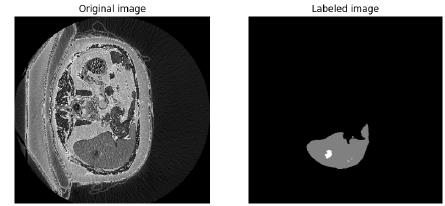

# DL for Healthcare
Final Project Report in AI in Audio Course (Reichman University)
by Idan Kashtan

Medical imaging plays a critical role in diagnosing and treating various diseases, including
detecting tumors. Liver tumors, both primary and metastatic, are a significant concern in
oncology, often requiring timely and accurate detection for effective intervention. In this
project, I aimed to use an AI model capable of detecting liver tumors in contrast-enhanced
CT images.

This repository includes the following:
* The report document with my analysis (pdf)
* One notebook with my implementation, testing, and results

## Results
Detailed results can be found in the report under:
* "Experimental Results"

### For the dataset
Inside the notebook, there is a section called "Installs". From there, you can download the medicaldecathlon dataset. 
